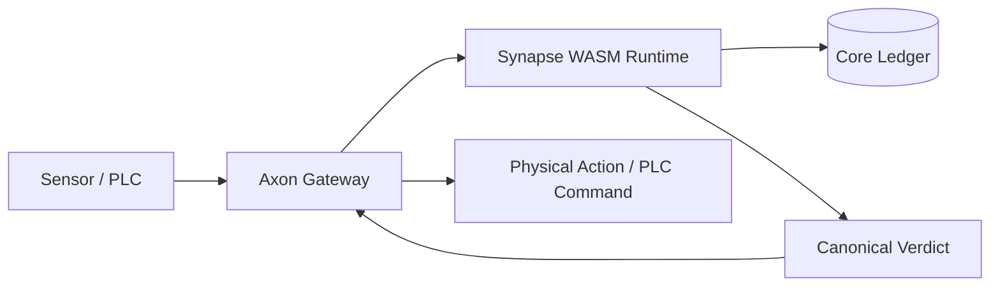
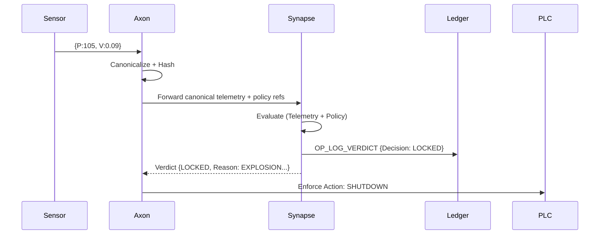
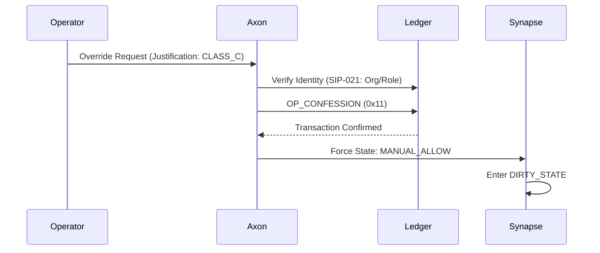
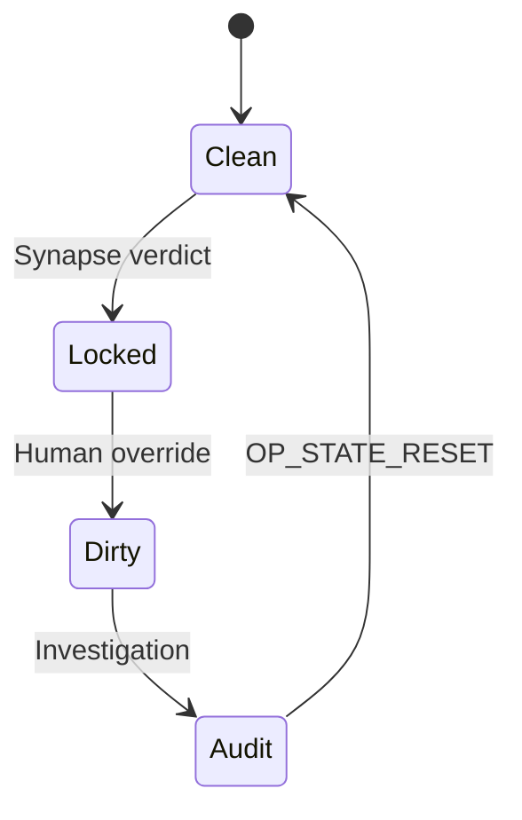

# SIP-019-A: Canonical Industrial Incident Scenario (CIIS v2.1)

| Field | Value |
| :--- | :--- |
| **SIP** | 019-A |
| **Title** | Canonical Industrial Incident Scenario (CIIS) |
| **Status** | PROPOSED STANDARD|
| **Type** | Informational / Reference Standard |
| **Layer** | Cross-Layer (Synapse / Axon / Ledger) |
| **Author** | Sopcos Core Developers |
| **Created** | 2026-01-23 |
| **Requires** | SIP-002, SIP-018, SIP-020, SIP-021 |
| **Motto** | *"Fast decisions. Slow liability."* |

--------------------------------------------------------------------------------
**1. Abstract**
This proposal defines the reference **Safety and Liability Workflow** for industrial automation events within the Sopcos ecosystem. CIIS v2.1 standardizes the following immutable invariant based on the "Smart Unit" architecture:
**One WASM Runtime + One Declarative Rule Set -> Deterministic Evaluation -> Single Canonical Verdict -> Ledger-Grade Evidence**
The system enforces a strict separation of duties:
• **Synapse:** Makes the Decision (Deterministic Adjudicator).
• **Axon:** Enforces the Action (Neutral Courier / Gateway).
• **Ledger (L1):** Anchors the Evidence (Policy + Verdict Proof).

**2. Motivation**
Industrial systems often fail at moments where **the decision occurs faster than responsibility can be assigned**. Traditional SCADA systems answer "What happened?", but remain silent on "Why did it happen, and who was responsible?".
CIIS is designed to ensure that after any accident, the following questions can be answered with cryptographic certainty:
 - Which policy was active?
 - Which exact rule (Rule ID) triggered the action?
 - Was the decision based on a single data point or a complex correlation (Smart Unit)?
 - Who intervened (Override), and under what authority?

**3. High-Level Architecture**
 - **3.1. Component Topology**
In this scenario, data flows from sensor to action via the following path:


 - **3.2. Responsibilities**

|Component  |Responsibility  |
| :--- | :--- |
| **Synapse** | Deterministic, isolated decision making (WASM Sandbox). |
| **Axon** | Policy validation, data routing, and action enforcement. |
| **Ledger (L1)** | Evidence Anchoring (The Immutable Record). |

**4. Policy Artifact Model (The Smart Unit)**
CIIS v2.1 separates the policy into "Rule" and "Judge" but governs them under a single **Policy Envelope (OP_ARTIFACT)**.
 - **4.1. Canonical Rulepack**
The following "Smart Unit" rules are defined for the `boiler_master_unit`. Note that the first rule is a **Correlation Rule**.

```json
{
  "meta": {
    "author": "did:sop:admin:0x8829102",
    "version": "2.0",
    "created_at": "2026-02-04T12:00:00Z"
  },
  "target_profile": "boiler_master_unit",
  "rules": [
    {
      "id": "EXPLOSION-RISK-CORRELATED",
      "condition": "pressure > 100.0 AND vibration > 0.08",
      "action": "LOCKED",
      "reason": "CRITICAL_PRESSURE_AND_VIBRATION_MATCH_EXPLOSION_PATTERN",
      "priority": 100
    },
    {
      "id": "PRESSURE-ABSOLUTE-LIMIT",
      "condition": "pressure > 120.0",
      "action": "LOCKED",
      "reason": "ABSOLUTE_PRESSURE_LIMIT_EXCEEDED",
      "priority": 90
    },
    {
      "id": "VIBRATION-WARNING",
      "condition": "vibration > 0.05",
      "action": "WARNING",
      "reason": "UNUSUAL_BEARING_WEAR_DETECTED",
      "priority": 50
    },
    {
      "id": "SYSTEM-NORMAL",
      "condition": "pressure <= 100.0 AND vibration <= 0.05",
      "action": "NORMAL",
      "reason": "ALL_SYSTEMS_NOMINAL",
      "priority": 1
    }
  ]
}
```
 - **4.2. Anchoring Strategy**
Axon refuses to execute any logic unless the Hash of this Rule Set and the Hash of the corresponding WASM binary are registered on L1 via `OP_ARTIFACT_REG` (0x50).

**5. The Scenario (Execution Script)**
Phase 1: The Incident (Correlation Trigger)
**Context:** Boiler pressure reaches `105.0` bar (Above Limit) and vibration reaches `0.09` G (Above Limit).  **Action:** Axon packages this data as "Smart Unit" telemetry and forwards it to Synapse.


**Synapse Decision (Canonical Verdict):**  Synapse deterministically selects the highest priority rule and produces the following JSON output:

```json
{
  "unit_verdict": "LOCKED",
  "rule_id": "EXPLOSION-RISK-CORRELATED",
  "reason": "CRITICAL_PRESSURE_AND_VIBRATION_MATCH_EXPLOSION_PATTERN",
  "priority": 100,
  "sub_verdicts": [
      {"signal": "pressure", "value": 105.0, "status": "FAIL"},
      {"signal": "vibration", "value": 0.09, "status": "FAIL"}
  ]
}
```
Phase 2: The Human Override (Liability Transfer)
**Context:** The system has transitioned to `LOCKED` state, halting production. The Operator believes the situation is under control and wishes to resume production (Continuity).
**Action:** The Operator initiates an **Override** via the Vinci Wallet.



**Ledger Record (OP_CONFESSION):**  This transaction transfers liability from the machine to the human.
• **Signer:**  `did:sop:operator:ali`
• **Justification:**  `CLASS_C` (Economic Continuity)
• **Target:**  `did:sop:boiler-01`

Phase 3: The Audit (Forensic Reproducibility)
After the event, an Auditor questions the validity of the decision.  **Method:** External logs are untrusted. The Auditor retrieves `Policy Hash`, `Rulepack Hash`, and `Telemetry Hash` from L1. They run the Synapse WASM in their own isolated environment.
**Result:** The Auditor's simulation produces the exact same `LOCKED` decision with the same `EXPLOSION-RISK-CORRELATED` rule ID. **The system is innocent.**

**6. State Model (The Lifecycle)**
The states the system passes through during the incident are as follows:


**7. Security & Liability Guarantees**
This scenario proves the fundamental promises of Sopcos:
1. **Correlation Power:** The system reacted not just to single values, but to their compound risk (Pressure + Vibration).
2. **Accountability:** The operator did not "hack" the system; they assumed responsibility using their authority (`OP_CONFESSION`).
3. **Non-Repudiation:** The decision is mathematically absolute, backed by signed WASM and signed Rule Sets.

**8. Final Principle**
**Synapse decides fast. Ledger remembers forever. Humans answer later.**

--------------------------------------------------------------------------------
*Copyright © 2026 Sopcos Protocol Foundation. All Rights Reserved.*
